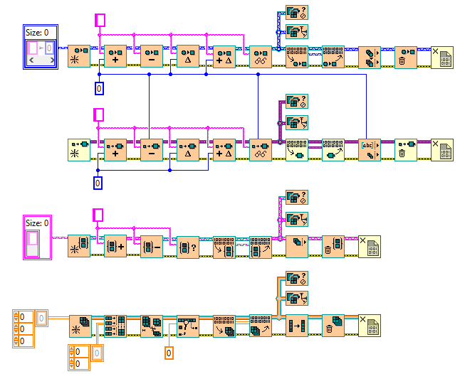

# LabVIEW DVR Collections

This repository contains VIMs that allow you to work with DVR versions of LabVIEW maps, sets, variant attributes, and arrays as if they were generics. It also enhances behaviors such as separating add and update operations and providing clearer and consistent connector labels.

# Minimum Requirements
* LabVIEW 2019 (32/64 bit) and above

# Showcase
VIs included in the repository:

